<div align="center">

<h3><code>netbyme@github:~$ ./contributions.sh</code></h3>



<br><br>

<h3><code>netbyme@github:~$ whoami</code></h3>



</div>

<br>

## `netbyme@github:~$ ls ~/projects`

| Project | Description | Technologies |
|---|---|---|
| **[auto-config-backup](https://github.com/netbyme/auto-config-backup)** | Securely backs up configurations from multiple network devices and generates timestamped CSV reports. | `Python` `Netmiko` `SSH` |
| **[network-monitor-alert](https://github.com/netbyme/network-monitor-alert)** | Monitors network hosts, detects state changes and sends alerts when devices fail or recover. | `Python` `ICMP` `SMTP` |
| **[network-scanner](https://github.com/netbyme/network-scanner)** | Concurrent IPv4 CIDR scanner with validation, host discovery and CSV reporting. | `Python` `Networking` `Concurrency` |
| **[ccna-packet-tracer-labs](https://github.com/netbyme/ccna-packet-tracer-labs)** | Practical Cisco labs covering switching, routing, VLANs, STP, EtherChannel, OSPF and IPv6. | `Cisco IOS` `Packet Tracer` `CCNA` |

<br>

## `netbyme@github:~$ cat current-focus.txt`

```text
Current role    : IT Support
Certification   : Cisco CCNA 200-301
Programming     : Python and Bash
Automation      : Netmiko and network scripting
Networking      : VLANs, STP, EtherChannel, OSPF and IPv6
Systems         : Linux, Windows and WSL
Career goal     : Network Automation Engineer
```

<br>

## `netbyme@github:~$ cat roadmap.txt`

```text
[■■■■■■■■░░] Cisco CCNA
[■■■■■■░░░░] Python for Networking
[■■■■░░░░░░] Network Automation
[■■░░░░░░░░] Cisco DevNet
```

<br>

## `netbyme@github:~$ contact --show`

```text
Location  : Casablanca, Morocco
LinkedIn  : hammouch-mohammed-5721763a6
GitHub    : netbyme
```

<div align="center">

[LinkedIn](https://linkedin.com/in/hammouch-mohammed-5721763a6) ·
[Repositories](https://github.com/netbyme?tab=repositories)

<br><br>

<sub><code>Building networks that configure themselves.</code></sub>

</div>